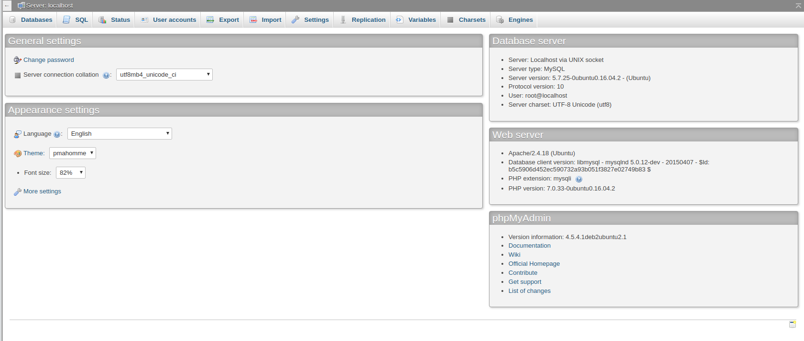
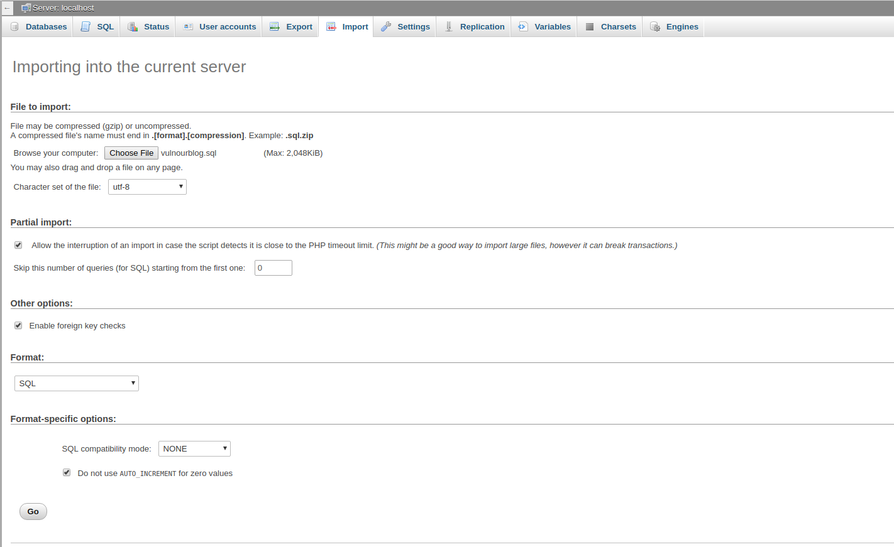
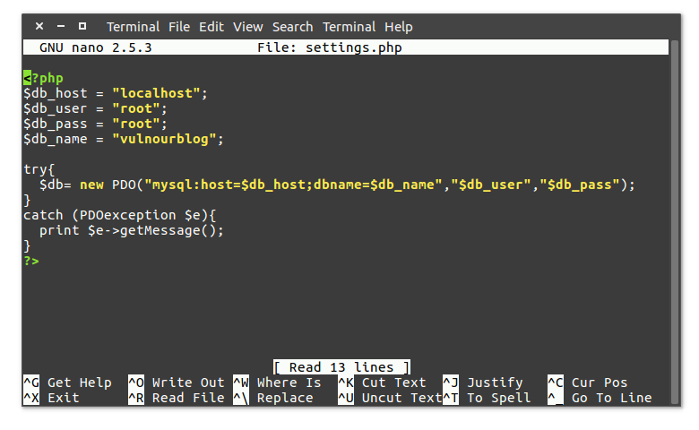
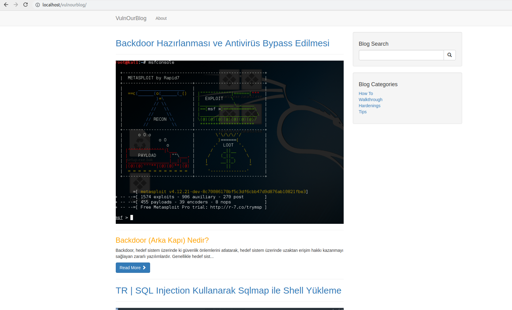

## Vulnourblog - Kurulum

**NOT :** Öncelikle bilgisayarınızda LAMP(Apache, MySQL, PHP) ve phpMyAdmin'nin yüklü olması gerekmektedir.

**NOT 2:** Bu anlatım Debian tabanlı dağıtımlar baz alınarak hazırlanmıştır. Farklı bir dağıtım kullanıyorsanız, adımlarda oluşacak farklılıklara dikkat ediniz.

**Not 3:** LAMP kurulumu yapmak ile uğraşmak istemiyorsanız, halihazırda içersinde LAMP yüklü gelen özelleştirilmiş dağıtımımız PauSiber Dev'i kullanabilirsiz. [**`dev.pausiber.xyz/`**](https://dev.pausiber.xyz/)

---

#### Apache sunucusu için kullanıcı izinlerinin ayarlanması

İlk olarak **`/var/www/html`** dizini için gerekli izinleri ayarlayalım.

```
sudo chown www-data:www-data -R /var/www/
```

```
sudo gpasswd --add KULLANICI_ADINIZ www-data
```

```
sudo chmod g+rwx -R /var/www
```

---

#### Gerekli dosyaların GitHub'dan çekilmesi

Vulnourblog dosyalarımızı yerel sunucumaza(bilgisayarımıza) çekelim.

```
cd /var/www/html
```

```
git clone https://github.com/PauSiber/vulnourblog.git
```

---

#### PhpMyAdmin üzerinden import işlemi

Şimdi veritabanımızı phpMyAdmin üzerinden yükleyelim (import).

- Yukarıdaki menüden **`Import`** yazan kısma tıklıyoruz.



- Şimdi githubdan çektiğimiz dosyaların içinde bulunan **`vulnourblog.sql`** isimli dosyamızı import edelim.

- **`Choose File`** butonuna tıklayıp **`vulnourblog.sql`** dosyamızı seçiyoruz. Ardından **`Go`** butonuna basarak işlemimizi tamamlıyoruz.

> Sol taraftaki menüye bakarsanız **`cypwn_vulnourblog`** isimli veritabanımızın oluştuğunu görebilirsiniz.



---

#### Veritabanı bağlantı ayarının yapılması

Şimdi son olarak veritabanı bağlantısını gerçekleştirelim.

```
nano /var/www/html/vulnourblog/include/settings.php
```

Bu kısımda **`$db_pass`** kısmına kendi PhpMyAdmin parolanızı yazmanız gerekmektedir. **`$db_name`** kısmını ise **`cypwn_vulnourblog`** olarak değiştirelim.




Tarayıcınızı açıp [**`http://localhost/vulnourblog/`**](http://localhost/vulnourblog/) adresine gidip çözmeye başlayabilirsiniz.


